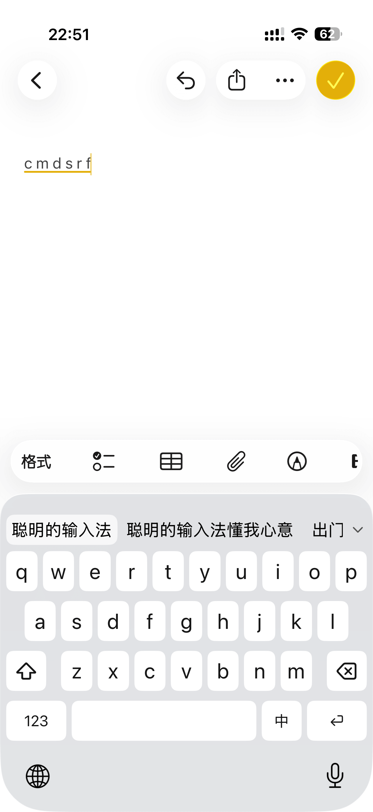
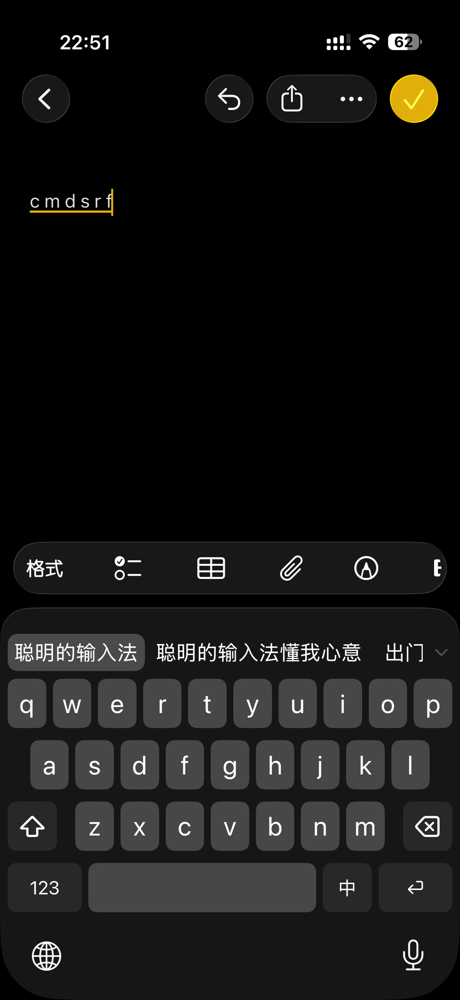

  

# Quill 输入法

一款极简的 iOS 拼音输入法，基于 RIME 引擎。

## 特性

- **全拼输入**：朙月拼音方案，支持中英混输
- **多设备同步**：通过 WebDAV 同步用户词库与自定义短语
- **深浅色跟随**：外观自动适配系统深浅色模式

## 截图

  
  

## 安装

1. 从 [Releases](https://github.com/qvshuo/Quill/releases) 下载最新未签名 ipa 后通过 AltStore、Feather 等工具自签后安装；
2. 打开「设置 → 通用 → 键盘 → 键盘」→「添加新键盘…」→ 选择 **Quill 输入法**；
3. 点按 Quill → 开启「允许完全访问」（同步功能必需）。

## 同步设置

打开 Quill 主应用，在「同步」区填写 WebDAV 信息：

1. **服务器地址 / 用户名 / 密码**：你的 WebDAV 服务（如 Koofr、坚果云）账号，仅支持 HTTPS；
2. 点「保存」，连接测试通过后凭据写入系统钥匙串；
3. 在任意设备上调出键盘，长按空格 3 秒即可同步（按住时顶部出现进度提示）。

多台设备使用不同「安装 ID」即可互相同步词库（默认 `Quill`，每台设备建议设为不同名称）。

## 隐私

- 词库学习完全在本机进行，不上传任何按键内容；
- 同步仅在你主动触发时进行，且只传输词库与自定义短语两个文件；
- 凭据保存在 iOS 钥匙串中。

## 许可

源代码以 [MIT](LICENSE) 许可发布；内置的 librime 及 RIME 数据遵循其各自的开源许可，详见 [THIRD-PARTY-NOTICES.md](THIRD-PARTY-NOTICES.md)。
